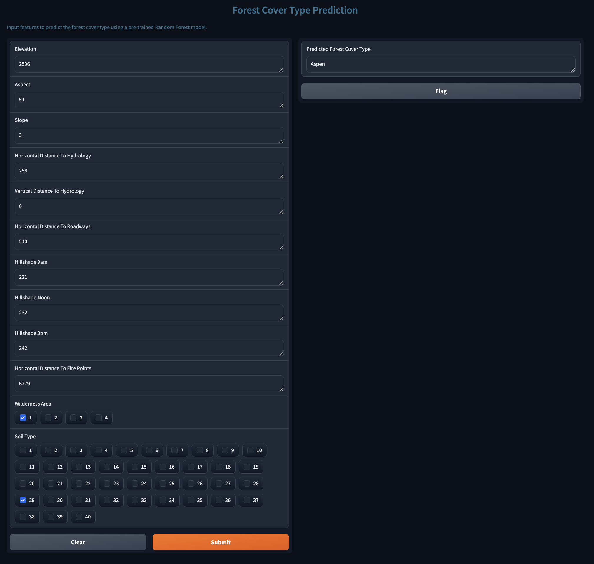

# Forest Covertype Prediciton

## Objective
This project is the part of my machine learning internship at Unified Mentor. The goal of this project was to develop a system that can predict the type of forest cover using analysis data for a 30m x 30m patch of land in the forest.

## Dataset
The orginal dataset is an analysis dataset from the forest department performed in the Roosevelt National Forest of northern Colorado.

### Integer Classification of the forest cover types:
● 1 - Spruce/Fir

● 2 - Lodgepole Pine

● 3 - Ponderosa Pine

● 4 - Cottonwood/Willow

● 5 - Aspen

● 6 - Douglas-fir

● 7 - Krummholz

### Description of main columns:
● Elevation - Elevation in meters

● Aspect - Aspect in degrees azimuth

● Slope - Slope in degrees

● Horizontal_Distance_To_Hydrology - Horz Dist to nearest surface water features

● Vertical_Distance_To_Hydrology - Vert Dist to nearest surface water features

● Horizontal_Distance_To_Roadways - Horz Dist to nearest roadway

● Hillshade_9am (0 to 255 index) - Hillshade index at 9am, summer solstice

● Hillshade_Noon (0 to 255 index) - Hillshade index at noon, summer solstice

● Hillshade_3pm (0 to 255 index) - Hillshade index at 3pm, summer solstice

● Horizontal_Distance_To_Fire_Points - Horz Dist to nearest wildfire ignition points

● Wilderness_Area (4 binary columns, 0 = absence or 1 = presence) - Wilderness area
designation

● Soil_Type (40 binary columns, 0 = absence or 1 = presence) - Soil Type designation

● Cover_Type - Forest Cover Type designation

## Approach
To achieve accurate classification, I explored various classifying techniques. I finalized Random Forest Classifier for the purpose of this project. The highest achieved average accuracy is 0.88. The model is saved as a pickle file.

## Training the classifier model
Run the Python notebook to train the classifier and save the model as a pickle file.

## Running the forest cover type prediction system
1. Load the .pkl model file and update the path to the model in the `app.py` file.
2. Run the `app.py` file using the command python app.py.
3. Input the features and run the prediction system. Output label will be displayed.

## Screenshots

